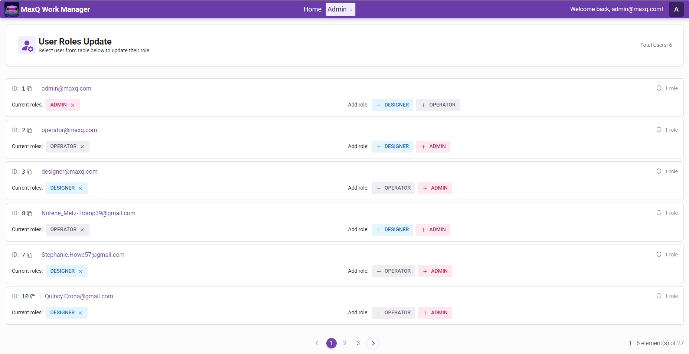

# MaxQ Employee and Work Management Platform

This application is a Mini Pet Project which allows for Employee and Work
Management.

## 🌐 Demo

[Application Demo (Frontend)](http://employee-work-management.s3-website.eu-west-3.amazonaws.com/)

**Demo Credentials:**

1. **Admin**:
    - **username:** admin@maxq.com
    - **password:** Admin12345
2. **Operator**:
    - **username:** operator@maxq.com
    - **password:** Operator12345
3. **Designer**:
    - **username:** designer@maxq.com
    - **password:** Designer12345

## 📖 About this Software

This application is an Employee and Work Management application to help with
project and employees managing easier.

### Features:

1. **Authorization:** Application allows for registration and authorization
   of users. Registered users are disabled by default - verification email
   will be sent to provided email. If verification expired a new one will be
   sent. Users can also request to reset their password from login page -
   this will send email to users with password reset.
2. **Authentication:** Role-base authentication is in place, as default
   three user roles are created - Admin, Operator and Designer.
3. **Admin:**
    - Admin can assign or revoke roles for users in Admin settings.

### Services:

1. **Frontend:** Built using React + Typescript handles all client side
   operations. Frontend code documentation can be seen be navigating to .
   /frontend directory and running `npm run docs:serve` command.
2. **Backend:** Backend is split into multiple microservices
    * **Discovery Service:** Built using Eureka and responsible for
      registering microservices in the application.
    * **Authorization Service:** Responsible for all authorization related
      operations - registration, registration verification, login -
      see [API docs here](https://authorization-service-0h7q.onrender.com/swagger-ui.html).
      Authorization service also provides role-based authentication.

### Technology stack

* **Frontend:**
    * Typescript
    * React
    * TailwindCSS
    * React-Router
    * Redux Toolkit
    * Vite + Vitest
    * React-Testing-Library
    * TypeDoc
    * **Hosting** - AWS S3
* **Backend:**
    * Java
    * Spring
    * Gradle
    * JUnit
    * Swagger UI (API docs)
    * Eureka (discovery services)
    * **Hosting** - Render
* **API Testing:**
    * Postman
* **UI Testing:**
    * PlaywrightTS
* **CI/CD:**
    * GitHub Actions

### CI/CD Pipelines

Several pipelines were created to allow automated integration, testing and
deployment:

1. Frontend CI pipeline - installs dependencies, lints, formats, tests and
   builds the application. Two artifacts are provided - test report
   (including coverage) and build files.
2. Backend CI pipeline - installs dependencies, lints, tests and builds the
   application. Unit test report is published as artifact.
3. API tests pipeline - after successfull build backend is tested with API
   tests. Report is published as artifact.
4. UI tests pipeline - if both API tests and Frontend CI pipeline is
   successfull UI tests are triggered. UI tests are split into
   multiple shards for faster execution. Report is published as artifact
5. Frontend CD pipeline - after successfull integration to main branch
   deployment will happen to AWS S3.

## 🖼️ Screenshots

To give you a visual overview of the application, here are some screenshots:

### Roles update in the Admin's settings page

